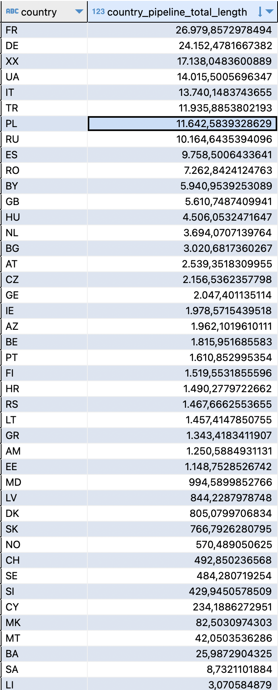

# show

A Python project / pipeline for processing spatial data using Postgres. 

---

## Overview

This repository contains a data pipeline to process spatial records using PostgreSQL. It includes schema definitions, utility functions, and a pipeline script. The purpose is to transform raw data, enforce schema checks, and produce processed results.

---

## Features

- Define and validate data schema  
- Extract, load, and transfform pipeline to process data into Postgres  
- Modular organization for functions and pipeline logic  
- Visual/graphical example of results included  

---

## Repository Structure

Here’s a quick guide to important files/folders:

| Path | Description |
|---|---|
| `.github/workflows/green_account_dbt` | CI/CD to run the pipeline as Github Actions |
| `schema/` | Holds schema definitions of the ingested data, defining a data contract |
| `functions.py` | Utility functions used across the project (validation, cleaning, etc.) |
| `green_account_postgres_pipeline.py` | The main pipeline script to process data into Postgres, uses dlt |
| `requirements.txt` | Python package dependencies |
| `results.png` | Example of output / result visualization |

---

## Requirements

- Python 3.x
- PostgreSQL database (version depending on your environment) 
- Required Python libraries (see `requirements.txt`)

---

## Setup

Below are steps to get this project running locally:

1. Clone the repository  
   ```bash
   git clone https://github.com/jabjakub/show.git
   cd show



